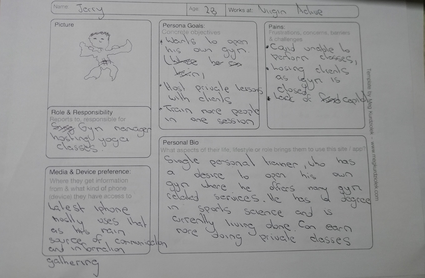
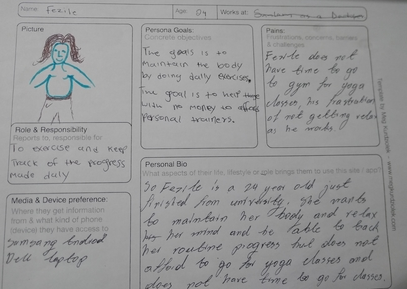
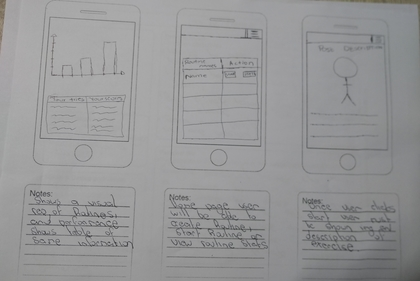
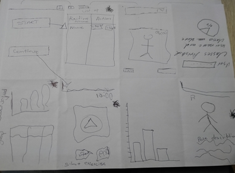
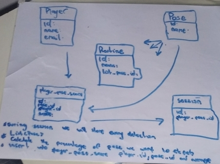

# Teachable Machine Hackathon

* * *
**Group Name**
# Umshini'oyshintshayo

**Participants**
* Sibusiso Nkosi
* Thaabit Jacobs
* Khanyisa Cairo
* Amanda Gxagxa

* * *

**Project vision statement**
* Players learn to stretch and to improve their physical fitness.

**What challenges does that solve?**
* Saving time.
* You don't need a personal trainer.
* You don't need to go to gym/studio.
* You can use it for exercising anywhere anytime.

**Who are the players?**
* People who don't have Yoga studios in their area.
* People who can't afford to pay for a personal trainer.
* People with little time.

** What is the learning loop**
* Select a routine that you want to do and perfom it then you will get feedback ,if the feedback is not good enough you can re-do and select another pose that is not harder.

**How do players Start**
* Select poses to practise/do and this builds a routine then click start on routines

**How do players progress**
* Players can use there previous stats from the same routine as references and do better

***How do players End**
* Players must go through the entire routines or click end to stop

* * *

|Pictures | Description |
|---------|--------------|
| | Persona - Sbuda : 28 year old taxi dpriver from Dunoon. Sbuda finished his matric in 2012 and started driving taxis in 2013. Has 2 sisters who stays in Nyanga East, they still in school and he supports them financially.|
| | Persona - Passengers : Township dweller who uses taxis everyday to travel. |
| | First we have Destination Table which will describe the location the passenger is travelling too and the price. Table where the driver can track his target. Last table is where the user can see the transaction |
| | First screen : Passenger can choose his/her destination and the amount it will charge and if the passenger will be getting any change or not. Second screen : Driver will have access to passenger information(How much has the passenger payed and how much will they need to get as a change). Option to view his total trips for the day and his target. Third screen: News feed - Any taxi strike in the area and petrol prices if has increased or not.|
| | Crazy 8 Prototype for our web app. |

* * *

